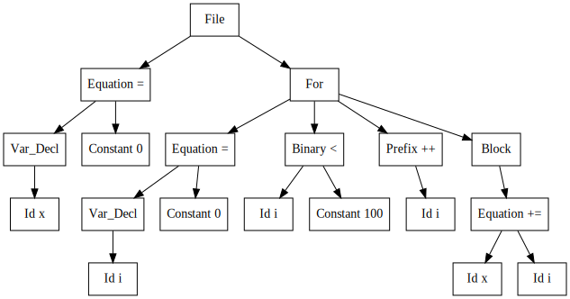
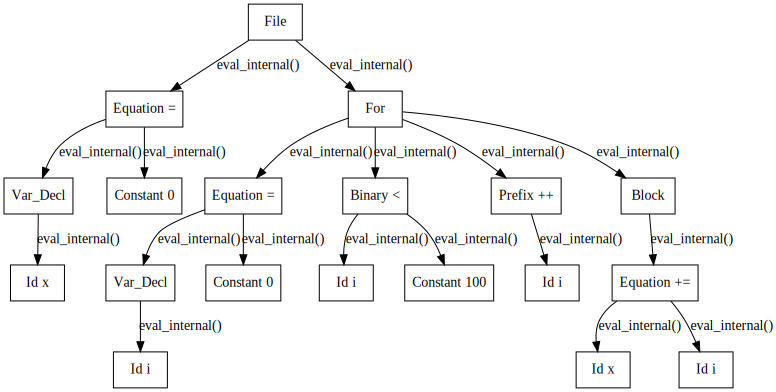
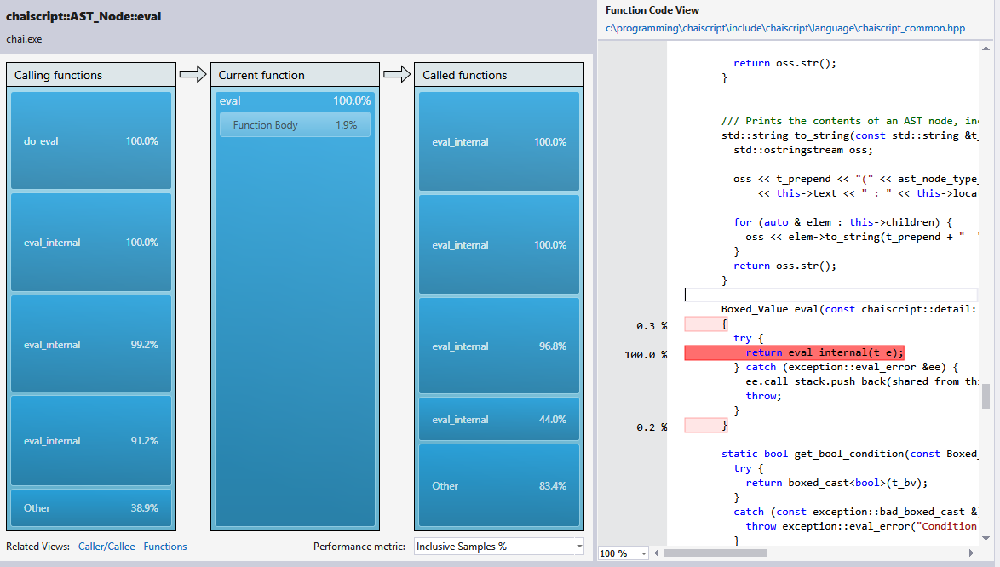
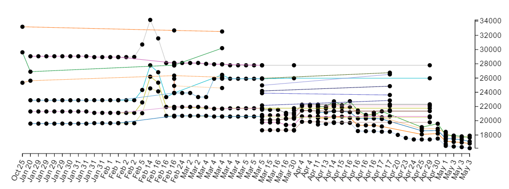
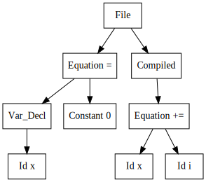

-----------------------------------

# Practical Performance Practices

## CppCon 2016

-----------------------------------


# Jason Turner

 * http://github.com/lefticus/presentations
 * http://cppcast.com
 * http://chaiscript.com
 * http://cppbestpractices.com
 * C++ Weekly - YouTube Series
 * @lefticus
 * Independent Contractor

I prefer an interactive session - please ask questions

---------------------------------------------

# Optimizing Compilers Are Amazing

```cpp
#include <string>

int main()
{
  std::string s("a");
  return s.size();
}
```

---------------------------------------------

# Optimizing Compilers Are Amazing

## g++ 5.1+

```x86asm
main:
        mov     eax, 1
        ret
```

---------------------------------------------

# Optimizing Compilers Are Amazing

```cpp
#include <string>

int main()
{
  return std::string("a").size() + std::string("b").size();
}
```

---------------------------------------------

# Optimizing Compilers Are Amazing

```x86asm
.LC0:
        .string "basic_string::_M_construct null not valid"
void std::__cxx11::basic_string<char, std::char_traits<char>, std::allocator<char> >::_M_construct<char const*>(char const*, char const*, std::forward_iterator_tag) [clone .isra.14]:
        push    r12
        push    rbp
        mov     r12, rsi
        push    rbx
        mov     rbp, rdi
        sub     rsp, 16
        test    rsi, rsi
        jne     .L4
        test    rdx, rdx
        je      .L4
        mov     edi, OFFSET FLAT:.LC0
        call    std::__throw_logic_error(char const*)
.L4:
        mov     rbx, rdx
        sub     rbx, r12
        cmp     rbx, 15
        mov     QWORD PTR [rsp+8], rbx
        ja      .L17
        cmp     rbx, 1
        mov     rdi, QWORD PTR [rbp+0]
        jne     .L5
        movzx   eax, BYTE PTR [r12]
        mov     BYTE PTR [rdi], al
        jmp     .L6
```


---------------------------------------------

# Optimizing Compilers Are Amazing

```x86asm
.L17:
        lea     rsi, [rsp+8]
        xor     edx, edx
        mov     rdi, rbp
        call    std::__cxx11::basic_string<char, std::char_traits<char>, std::allocator<char> >::_M_create(unsigned long&, unsigned long)
        mov     rdx, QWORD PTR [rsp+8]
        mov     QWORD PTR [rbp+0], rax
        mov     rdi, rax
        mov     QWORD PTR [rbp+16], rdx
.L5:
        mov     rdx, rbx
        mov     rsi, r12
        call    memcpy
.L6:
        mov     rax, QWORD PTR [rsp+8]
        mov     rdx, QWORD PTR [rbp+0]
        mov     QWORD PTR [rbp+8], rax
        mov     BYTE PTR [rdx+rax], 0
        add     rsp, 16
        pop     rbx
        pop     rbp
        pop     r12
        ret
.LC2:
        .string "a"
.LC3:
        .string "b"
```


---------------------------------------------

# Optimizing Compilers Are Amazing

```x86asm
main:
        push    rbx
        mov     edx, OFFSET FLAT:.LC2+1
        mov     esi, OFFSET FLAT:.LC2
        sub     rsp, 64
        lea     rax, [rsp+16]
        mov     rdi, rsp
        mov     QWORD PTR [rsp], rax
        call    void std::__cxx11::basic_string<char, std::char_traits<char>, std::allocator<char> >::_M_construct<char const*>(char const*, char const*, std::forward_iterator_tag) [clone .isra.14]
        lea     rax, [rsp+48]
        lea     rdi, [rsp+32]
        mov     edx, OFFSET FLAT:.LC3+1
        mov     esi, OFFSET FLAT:.LC3
        mov     rbx, QWORD PTR [rsp+8]
        mov     QWORD PTR [rsp+32], rax
        call    void std::__cxx11::basic_string<char, std::char_traits<char>, std::allocator<char> >::_M_construct<char const*>(char const*, char const*, std::forward_iterator_tag) [clone .isra.14]
        mov     rdi, QWORD PTR [rsp+32]
        lea     rax, [rsp+48]
        add     ebx, DWORD PTR [rsp+40]
        cmp     rdi, rax
        je      .L19
        call    operator delete(void*)
.L19:
        mov     rdi, QWORD PTR [rsp]
        lea     rax, [rsp+16]
        cmp     rdi, rax
        je      .L24
        call    operator delete(void*)
```


---------------------------------------------

# Optimizing Compilers Are Amazing

```x86asm
.L24:
        add     rsp, 64
        mov     eax, ebx
        pop     rbx
        ret
        mov     rdi, QWORD PTR [rsp]
        lea     rdx, [rsp+16]
        mov     rbx, rax
        cmp     rdi, rdx
        je      .L22
        call    operator delete(void*)
.L22:
        mov     rdi, rbx
        call    _Unwind_Resume
```

---------------------------------------------

# Optimizing Compilers Are Amazing

> - But trying to predict what the compiler can optimize is a risky game

-----------------------------------


# Profiling ChaiScript

> - Performance measuring ChaiScript is difficult
> - Great number of template instantations
> - Nature of scripting means execution is spread over many similar functions

-----------------------------------

# Parsed Nodes

```
var x = 0;

for (var i = 0; i < 100; ++i) { 
  x += i; 
}
```



-----------------------------------

# Parsed Nodes

```
var x = 0;

for (var i = 0; i < 100; ++i) { 
  x += i; 
}
```




-----------------------------------

# Performance Profiling




-----------------------------------


# Performance Practices

This led to the creation of several rules and practices that I follow to make well-performing code 'by default'


-----------------------------------


# Which Is Better In Normal Use?

### `std::vector`  

### - or -  

### `std::list`


> - WHY?


-----------------------------------

# `std::list`

-----------------------------------

# `std::list`

```cpp
int main()
{
  std::list<int> v{1};
}
```

 - What has to happen here?
 

-----------------------------------

# `std::list`

```x86asm
main:
        pushq   %r12
        pushq   %rbp
        movl    $24, %edi
        pushq   %rbx
        subq    $32, %rsp
        movq    $0, 16(%rsp)
        movq    %rsp, %rbp
        movq    %rsp, (%rsp)
        movq    %rsp, 8(%rsp)
        call    operator new(unsigned long)
        movq    %rax, %rdi
        movq    $0, (%rax)
        movq    $0, 8(%rax)
        movl    $1, 16(%rax)
        movq    %rsp, %rsi
        call    std::__detail::_List_node_base::_M_hook(std::__detail::_List_node_base*)
        movq    (%rsp), %rdi
        addq    $1, 16(%rsp)
        cmpq    %rsp, %rdi
        je      .L9
```

-----------------------------------

# `std::list`

```x86asm
.L10:
        movq    (%rdi), %rbp
        call    operator delete(void*)
        cmpq    %rbx, %rbp
        movq    %rbp, %rdi
        jne     .L10
.L9:
        addq    $32, %rsp
        xorl    %eax, %eax
        popq    %rbx
        popq    %rbp
        popq    %r12
        ret
        movq    (%rsp), %rdi
        movq    %rax, %rbp
```


-----------------------------------

# `std::list`

```x86asm
.L5:
        cmpq    %rbx, %rdi
        je      .L4
        movq    (%rdi), %r12
        call    operator delete(void*)
        movq    %r12, %rdi
        jmp     .L5
.L4:
        movq    %rbp, %rdi
        call    _Unwind_Resume
```


-----------------------------------


# `std::list`

> - Allocate a new node
> - Handle exception thrown during node allocation?
> - Assign the value
> - Hook up some pointers
> - Delete node
> - etc?

-----------------------------------

# `std::vector`

-----------------------------------


# `std::vector`

```cpp
int main()
{
  std::vector<int> v{1};
}
```

 - What has to happen here?


-----------------------------------


# `std::vector`

```x86asm
main:
        subq    $8, %rsp
        movl    $4, %edi
        call    operator new(unsigned long)
        movl    $1, (%rax)
        movq    %rax, %rdi
        call    operator delete(void*)
        xorl    %eax, %eax
        addq    $8, %rsp
        ret
```

> - Allocate a buffer
> - Assign a value in the buffer
> - Delete the buffer


----------------------------------------

# Part 1: Don't Do More Work Than You Have To

----------------------------------------

# Don't Do More Work Than You Have To

## What about `std::array`?

```cpp
int main()
{
  std::array<int, 1> v{1};
}
```


----------------------------------------


# Don't Do More Work Than You Have To

## What about `std::array`?

```cpp
int main()
{
  std::array<int, 1> v{1};
}
```


```x86asm
main:
        xorl    %eax, %eax
        ret
```

 - Code is completely compiled away


----------------------------------------


# Don't Do More Work Than You Have To

## Container Practices

 - Always prefer `std::array`
 - Then `std::vector`
 - Then only differ if you need specific behavior
 - Make sure you understand what the library has to do


-----------------------------------


# Don't Do More Work Than You Have To

```cpp
int main()
{
  std::string s;
  s = "A Somewhat Rather Long String";
}
```

> - Construct a string object
> - Reassign string object


-----------------------------------


# Don't Do More Work Than You Have To

## *Always `const`*

```cpp
int main()
{
  const std::string s = "A Somewhat Rather Long String";
}
```

> - Construct and initialize in one step
> - ~32% more efficient


-----------------------------------


# Don't Do More Work Than You Have To

## Always `const` - Complex Initialization

```cpp
int main()
{
  const int i = std::rand();
  std::string s;
  switch (i % 4) {
    case 0:
      s = "long string is mod 0";
      break;
    case 1:
      s = "long string is mod 1";
      break;
    case 2:
      s = "long string is mod 2";
      break;
    case 3:
      s = "long string is mod 3";
      break;
  }
}
```

 - How can we make `s` `const` in this context?


-----------------------------------


# Don't Do More Work Than You Have To

## Always `const` - Complex Initialization - *Use IIFE*

```cpp
int main()
{
  const int i = std::rand();
  const std::string s = [&](){
    switch (i % 4) {
      case 0:
        return "long string is mod 0";
      case 1:
        return "long string is mod 1";
      case 2:
        return "long string is mod 2";
      case 3:
        return "long string is mod 3";
    }
  }();
}
```

 - ~31% more efficient


-----------------------------------


# Don't Do More Work Than You Have To

## *Always Initialize* When Const Isn't Practical

```cpp
struct Int
{
  Int(std::string t_s)
  {
    m_s = t_s;
  }

  int val() const {
    return std::atoi(m_s.c_str());
  }

  std::string m_s;
};
```

> - Same issues as previous examples


-----------------------------------


# Don't Do More Work Than You Have To

## *Always Initialize* When Const Isn't Practical

```cpp
struct Int
{
  Int(std::string t_s) : m_s(std::move(t_s))
  {
  }

  int val() const {
    return std::atoi(m_s.c_str());
  }

  std::string m_s;
};
```

> - Same gains as const initializer
> - What's wrong with this version now?
> - val() parses string on each call


-----------------------------------


# Don't Do More Work Than You Have To

## *Don't Recalculate Values* - Calculate on First Use

```cpp
struct Int
{
  Int(std::string t_s) : s(std::move(t_s))
  { }

  int val() const {
    if (!is_calculated) {
      value = std::atoi(s);
    }
    return value;
  }

  mutable bool is_calculated = false;
  mutable int value;
  std::string s;
};
```

> - What's wrong now?
> - C++ Core Guidelines state that const methods should be thread safe
> - What else?
> - `is_calculated` isn't being set


-------------------------------------


# Don't Do More Work Than You Have To

## *Don't Recalculate Values* - Calculate On First Use

```cpp
struct Int
{
  Int(std::string t_s) : s(std::move(t_s))
  { }

  int val() const {
    if (!is_calculated) {
      value = std::atoi(s);
      is_calculated = true;
    }
    return value;
  }

  mutable std::atomic_bool is_calculated = false;
  mutable std::atomic_int value;
  std::string s;
};
```

> - Branching is slower
> - Atomics are slower


-----------------------------------


# Don't Do More Work Than You Have To

## *Don't Recalculate Values* - Calculate At Construction

```cpp
struct Int
{
  Int(const std::string &t_s) : m_i(std::atoi(t_s.c_str()))
  { }

  int val() const {
    return m_i;
  }

  int m_i;
};
```

> - No branching, no atomics, smaller runtime (int vs string)
> - In the context of a large code base, this took ~2 years to find
> - Resulted in 10% performance improvement across system
> - *The simpler solution is almost always the best solution*


-----------------------------------


# Don't Do More Work Than You Have To

## Initialization Practices

 * Always const
 * Always initialize
 * Using IIFE can help you initialize
 * Don't recalculate values that can be calculated once


----------------------------------------


# Don't Do More Work Than You Have To

```cpp
struct Base {
  virtual ~Base() = default;
  virtual void do_a_thing() = 0;
};

struct Derived : Base {
  virtual ~Derived() = default;
  void do_a_thing() override {}
};
```

> - What's wrong here?
> - move construction / assignment is disabled (virtual destructor)
> - `virtual ~Derived()` is unnecessary


----------------------------------------


# Don't Do More Work Than You Have To

## *Don't Disable Move Operations / Use Rule of 0*

```cpp
struct Base {
  virtual ~Base() = default;
  Base() = default;
  Base(const Base &) = default; Base& operator=(const Base&) = default;
  Base(Base &&) = default; Base& operator=(Base &&) = default;

  virtual void do_a_thing() = 0;
};

struct Derived : Base {
  virtual void do_a_thing() {}
};
```

> - 10% improvement with fixing this in just one commonly used class

---------------------------------------------

# Don't Do More Work Than You Have To

## On The Topic Of Copying

```cpp
#include <string>

struct S {
  S(std::string t_s) : s(std::move(t_s)) {}
  std::string s;
};

int main()
{
  for (int i = 0; i < 10000000; ++i) {
    std::string s = std::string("a not very short string") + "b";
    S o(s);
  }
}
```

> - We all know that copying objects is bad
> - So let's use `std::move`

---------------------------------------------

# Don't Do More Work Than You Have To

## On The Topic Of Copying


```cpp
#include <string>

struct S {
  S(std::string t_s) : s(std::move(t_s)) {}
  std::string s;
};

int main()
{
  for (int i = 0; i < 10000000; ++i) {
    std::string s = std::string("a not very short string") + "b";
    S o(std::move(s));
  }
}
```

> - 29% more efficient
> - 32% smaller binary
> - Good! But what's better?

---------------------------------------------

# Don't Do More Work Than You Have To

## *Avoid Named Temporaries*


```cpp
#include <string>

struct S {
  S(std::string t_s) : s(std::move(t_s)) {}
  std::string s;
};

int main()
{
  for (int i = 0; i < 10000000; ++i) {
    S o(std::string("a not very short string") + "b");
  }
}
```

> - 2% more efficient again
> - Can lead to less readable code sometimes, but more maintainable than `std::move` calls
> - This is taking the "don't declare a variable until you need it" philosophy to its ultimate conclusion

-------------------------------------


# Don't Do More Work Than You Have To


```cpp
int use_a_base(std::shared_ptr<Base> p)
{
  return p->value();
}

int main()
{
  auto ptr = std::make_shared<Derived>();
  use_a_base(ptr);
}
```

> - What's the problem here?
> - Copies are being made of `shared_ptr<Base>`

---------------------------------------------


# Don't Do More Work Than You Have To

## *Avoid (`shared_ptr`) Copies*

```cpp
int use_a_base(const std::shared_ptr<Base> &p)
{
  return p->value();
}

int main()
{
  auto ptr = std::make_shared<Derived>();
  use_a_base(ptr);
}
```

> - Fixed!
> - Right?
> - Wrong!


---------------------------------------------


# Don't Do More Work Than You Have To

## *Avoid Automatic Conversions*

```cpp
int use_a_base(const Base &p)
{
  return p->value();
}

int main()
{
  auto ptr = std::make_shared<Derived>();
  use_a_base(ptr.get());
}
```

 - This version is 2.5x faster than the last


-----------------------------------


# Don't Do More Work Than You Have To

## `std::endl`


```cpp
void println(ostream &os, const std::string &str)
{
  os << str << std::endl;
}
```

> - What does `std::endl` do?
> - it's equivalent to `'\n' << std::flush`
> - Expect that flush to cost you at least 9x overhead in your IO

-----------------------------------


# Don't Do More Work Than You Have To

## Real World `std::endl` Anecdote

```cpp
void write_file(std::ostream &os) {
  os << "a line of text" << std::endl;
  os << "another line of text" << std::endl;
  /* snip */
  os << "many more lines of text" << std::endl;
}

void write_file(const std::string &filename) {
  std::ofstream ofs(filename.c_str());
  write_file(ofs);
}

std::string get_file_as_string() {
  std::stringstream ss;
  write_file(ss);
  return ss.str();
}
```

---------------------------------------------------


# Don't Do More Work Than You Have To

## *Avoid `std::endl`*

Prefer just using `'\n'`

```cpp
void println(ostream &os, const std::string &str)
{
  os << str << '\n';
}
```


-----------------------------------


# Don't Do More Work Than You Have To

## Hidden Work Practices

 * Calculate values once - at initialization time
 * Obey the rule of 0
 * If it looks simpler, it's probably faster
 * Avoid object copying
 * Avoid automatic conversions
    * Don't pass smart pointers
    * Make conversion operations explicit
 * Avoid `std::endl`


----------------------------------------


# Don't Do More Work Than You Have To

## `shared_ptr` Instantiations


----------------------------------------


# Don't Do More Work Than You Have To

## `shared_ptr` Instantiations

```cpp
int main() {
  std::make_shared<int>(1);
}
```


-----------------------------------------


# Don't Do More Work Than You Have To

## `shared_ptr` Instantiations


```x86asm
std::_Sp_counted_ptr_inplace<int, std::allocator<int>, (__gnu_cxx::_Lock_policy)2>::~_Sp_counted_ptr_inplace():
        rep ret
std::_Sp_counted_ptr_inplace<int, std::allocator<int>, (__gnu_cxx::_Lock_policy)2>::_M_dispose():
        rep ret
std::_Sp_counted_ptr_inplace<int, std::allocator<int>, (__gnu_cxx::_Lock_policy)2>::_M_get_deleter(std::type_info const&):
        movq    8(%rsi), %rsi
        movq    %rdi, %rdx
        cmpq    typeinfo name for std::_Sp_make_shared_tag, %rsi
        je      .L4
        xorl    %eax, %eax
        cmpb    $42, (%rsi)
        je      .L3
        movl    typeinfo name for std::_Sp_make_shared_tag, %edi
        movl    $24, %ecx
        repz cmpsb
        jne     .L3
.L4:
        leaq    16(%rdx), %rax
```


--------------------------------------


# Don't Do More Work Than You Have To

## `shared_ptr` Instantiations

```x86asm
.L3:
        rep ret
std::_Sp_counted_ptr_inplace<int, std::allocator<int>, (__gnu_cxx::_Lock_policy)2>::~_Sp_counted_ptr_inplace():
        movl    $24, %esi
        jmp     operator delete(void*, unsigned long)
std::_Sp_counted_ptr_inplace<int, std::allocator<int>, (__gnu_cxx::_Lock_policy)2>::_M_destroy():
        jmp     operator delete(void*)
main:
        pushq   %rbx
        movl    $24, %edi
        call    operator new(unsigned long)
        movq    %rax, %rbx
        movl    $1, 8(%rax)
        movl    $1, 12(%rax)
        movq    vtable for std::_Sp_counted_ptr_inplace<int, std::allocator<int>, (__gnu_cxx::_Lock_policy)2>+16, (%rax)
        movl    $0, 16(%rax)
        movl    __gthrw___pthread_key_create(unsigned int*, void (*)(void*)), %eax
        testq   %rax, %rax
        je      .L17
        leaq    8(%rbx), %rdi
        orl     $-1, %esi
        call    __gnu_cxx::__exchange_and_add(int volatile*, int)
        subl    $1, %eax
        je      .L26
```


----------------------------------------


# Don't Do More Work Than You Have To

## `shared_ptr` Instantiations

```x86asm
.L22:
        xorl    %eax, %eax
        popq    %rbx
        ret
.L17:
        movl    $0, 8(%rbx)
        movl    $0, 12(%rbx)
.L23:
        movq    (%rbx), %rax
        movq    %rbx, %rdi
        movq    24(%rax), %rax
        call    *%rax
        jmp     .L22
.L26:
        movq    (%rbx), %rax
        movq    %rbx, %rdi
        movq    16(%rax), %rax
        call    *%rax
        leaq    12(%rbx), %rdi
        orl     $-1, %esi
        call    __gnu_cxx::__exchange_and_add(int volatile*, int)
        subl    $1, %eax
        jne     .L22
        jmp     .L23
```


----------------------------------------


# Don't Do More Work Than You Have To

## `unique_ptr` Instantiations


----------------------------------------


# Don't Do More Work Than You Have To

## `unique_ptr` Instantiations

```cpp
int main()
{
  std::make_unique<int>(0);
}
```

> - What does this have to do?

----------------------------------------


# Don't Do More Work Than You Have To

## `unique_ptr` Instantiations

```cpp
int main()
{
  std::make_unique<int>(0);
}
```

```x86asm
main:
        sub     rsp, 8
        mov     edi, 4
        call    operator new(unsigned long)
        mov     esi, 4
        mov     DWORD PTR [rax], 0
        mov     rdi, rax
        call    operator delete(void*, unsigned long)
        xor     eax, eax
        add     rsp, 8
        ret
```

----------------------------------------

# Don't Do More Work Than You Have To

## `unique_ptr` Compared To Manual Memory Management

```cpp
int main()
{
  auto i = new int(0);
  delete i;
}
```

```x86asm
main:
        sub     rsp, 8
        mov     edi, 4
        call    operator new(unsigned long)
        mov     esi, 4
        mov     DWORD PTR [rax], 0
        mov     rdi, rax
        call    operator delete(void*, unsigned long)
        xor     eax, eax
        add     rsp, 8
        ret
```

Identical


----------------------------------------

# Part 1: Don't Do More Work Than You Have To - Summary

 - Avoid `shared_ptr`
 - Avoid `std::endl`
 - Always `const`
 - Always initialize with meaningful values
 - Don't recalculate immutable results

----------------------------------------

# Part 1: Questions?

----------------------------------------


# Part 2: Smaller Code Is Faster Code


----------------------------------------


# Smaller Code Is Faster Code

```cpp
struct B
{
  virtual ~B() = default; // plus the other default operations
  virtual std::vector<int> get_vec() const = 0;
};

template<typename T>
struct D : B
{
  std::vector<int> get_vec() const override { return m_v; }
  std::vector<int> m_v;
}
```

> - With many template instantiations this code blows up in size quickly


----------------------------------------


# Smaller Code Is Faster Code

## DRY In Templates

```cpp

struct B
{
  virtual ~B() = default; // plus the other default operations
  virtual std::vector<int> get_vec() const { return m_v; }
  std::vector<int> m_v;
};

template<typename T>
struct D : B
{
}
```


----------------------------------------


# Smaller Code Is Faster Code

## Factories


----------------------------------------


# Smaller Code Is Faster Code

## Factories

```cpp
struct B {
  virtual ~B() = default;
};

template<int T>
struct D : B {
};

template<int T>
std::shared_ptr<B> d_factory() {
  return std::make_shared<D<T>>();
}

int main() {
  std::vector<std::shared_ptr<B>> v{
    d_factory<1>(), d_factory<2>(), /* ... */ , d_factory<29>(), d_factory<30>()
  };
}
```

> - Prefer returning `unique_ptr<>` (Back To The Basics - Herb Sutter ~0:19)
> - We already saw that `shared_ptr<>` is big - don't make more than you have to


----------------------------------------


# Smaller Code Is Faster Code

## *Prefer return `unique_ptr<>` from factories*

```cpp
struct B {
  virtual ~B() = default;
};

template<int T>
struct D : B {
};

template<int T>
std::unique_ptr<B> d_factory() {
  return std::make_unique<D<T>>();
}

int main() {
  std::vector<std::shared_ptr<B>> v{
    d_factory<1>(), d_factory<2>(), /* ... */ , d_factory<29>(), d_factory<30>()
  };
}
```


----------------------------------------


# Smaller Code Is Faster Code

## *Prefer return `unique_ptr<>` from factories*

```cpp
template<int T> std::unique_ptr<B> d_factory()
{
  return std::make_unique<D<T>>();
}
```

1.30s compile, 30k exe, 149796k compile RAM

```cpp
template<int T> std::shared_ptr<B> d_factory()
{
  return std::make_shared<D<T>>();
}
```

2.24s compile, 70k exe, 164808k compile RAM


```cpp
template<int T> std::shared_ptr<B> d_factory()
{
  return std::make_unique<D<T>>();
}
```

2.43s compile, 91k exe, 190044k compile RAM

----------------------------------------


# Smaller Code Is Faster Code

## *Prefer return `unique_ptr<>` from factories* - ChaiScript Numbers

```cpp
std::unique_ptr<B> d_factory()
{
  return std::make_unique<D>();
}
```

4925k exe

```cpp
std::shared_ptr<B> d_factory()
{
  return std::make_shared<D>();
}
```

7350k exe, ~6% slower

```cpp
std::shared_ptr<B> d_factory()
{
  return std::make_unique<D>();
}
```

7573k exe, ~10% slower (very surprising when I found this bottleneck)


----------------------------------------


# Smaller Code Is Faster Code

## *Prefer return `unique_ptr<>` from factories* - A Note About Performance

```cpp
template<int T> std::shared_ptr<B> d_factory()
{
  return std::make_shared<D<T>>();
}
```

> - This `make_shared` version is faster in raw performance
> - If you create many short-lived shared bjects, the `make_shared` version is fastest
> - If you create long-lived shared objects, use the `make_unique` version is fastest
> - C++ Core Guidelines are surprisingly inconsistent in examples for factories

-----------------------------------------

# Smaller Code Is Faster Code

```cpp
std::string add(const std::string &lhs, const std::string &rhs) {
  return lhs + rhs;
}

int main() {
  const std::function<std::string (const std::string &)> f 
    = std::bind(add, "Hello ", std::placeholders::_1);
  f("World");
}
```

------------------------------------------

# Smaller Code Is Faster Code

## *Avoid `std::function<>`*

```cpp
std::string add(const std::string &lhs, const std::string &rhs) {
  return lhs + rhs;
}

int main() {
  const std::function<std::string (const std::string &)> f 
    = std::bind(add, "Hello ", std::placeholders::_1);
  f("World");
}
```

> - 2.9x slower than bare function call
> - 30% compile time overhead
> - ~10% compile size overhead

------------------------------------------


# Smaller Code Is Faster Code

## *Never. Ever. Ever. Use `std::bind`*

```cpp
std::string add(const std::string &lhs, const std::string &rhs) {
  return lhs + rhs;
}

int main() {
  const auto f = std::bind(add, "Hello ", std::placeholders::_1);
  f("World");
}
```

> - 1.9x slower than bare function call
> - ~15% compile time overhead
> - Effective Modern C++ #34
> - Any talk on `std::function` from STL

------------------------------------------

# Smaller Code Is Faster Code

## *Use Lambdas*

```cpp
std::string add(const std::string &lhs, const std::string &rhs) {
  return lhs + rhs;
}

int main() {
  const auto f = [](const std::string &b) {
    return add("Hello ", b);
  };
  f("World");
}
```

> - 0 overhead compared to direct function call
> - 0% compile time overhead


------------------------------------------


# Part 2: Smaller Code Is Faster Code - Summary

 - Don't repeat yourself in templates
 - Avoid use of `shared_ptr`
 - Avoid `std::function`
 - Never use `std::bind`


------------------------------------------


# Part 2: Smaller Code Is Faster Code - Questions

------------------------------------------

# Bonus Slide - Avoid Non-Local Data

## Non-Locals Tend To

> 1. Be statics - which have a cost associated
> 2. Need some kind of mutex protection
> 3. Be in a container with on-trivial lookup costs (`std::map<>` for example)

------------------------------------------


# Summary

 - First ask yourself: What am I asking the compiler to do here?

## Initialization Practices

 * Always const
 * Always initialize

## Hidden Work Practices

 * Calculate values once - at initialization time
 * Obey the rule of 0
 * If it looks simpler, it's probably faster
 * Avoid automatic conversions - use `explicit`
 * avoid `std::endl`


-------------------------------------------


# Summary (Continued)


## Container Practices

 - Always prefer `std::array`
 - Then `std::vector`
 - Then only differ if you need specific behavior
 - Make sure you understand what the library has to do

## Smaller Code Is Faster Code Practices

 - Don't repeat yourself in templates
 - Avoid use of `std::shared_ptr`
 - Avoid `std::function`
 - Never use `std::bind`


-----------------------------------


# Performance History


-----------------------------------

# Performance Monitoring



------------------------------------------

# What About `constexpr`?

------------------------------------------

# What About `constexpr`?

```cpp
template<typename Itr>
constexpr bool is_sorted(Itr begin, const Itr &end)
{
  Itr start = begin;  
  ++begin;
  while (begin != end) {
    if (!(*start < *begin)) { return false; }
    start = begin;
    ++begin;
  }
  return true;
}

template<typename T>
constexpr bool is_sorted(const std::initializer_list<T> &l) {
  return is_sorted(l.begin(), l.end());
}

int main()
{
  return is_sorted({1,2,3,4,5});
}
```

------------------------------------------

# What About `constexpr`?

```x86asm
main:                                   # @main
        mov     eax, 1
        ret
```

------------------------------------------

# What About *Not* `constexpr`?

```cpp
template<typename Itr>
bool is_sorted(Itr begin, const Itr &end)
{
  Itr start = begin;  
  ++begin;
  while (begin != end) {
    if (!(*start < *begin)) { return false; }
    start = begin;
    ++begin;
  }
  return true;
}

template<typename T>
bool is_sorted(const std::initializer_list<T> &l) {
  return is_sorted(l.begin(), l.end());
}

int main()
{
  return is_sorted({1,2,3,4,5});
}
```

> - What does this compile to?

------------------------------------------

# What About *Not* `constexpr`? (with optimizations enabled)

```x86asm
main:                                   # @main
        mov     eax, 1
        ret
```

------------------------------------------

# `constexpr`

> - Full `constexpr` enabling of every data structure that can be can result in bigger code
> - Bigger code is often slower code
> - If you enable `constexpr` make sure you go all the way


------------------------------------------

# So Why Does This All Work?


------------------------------------------

# So Why Does This All Work?

## Branches and Predictions

> - Code branches are expensive
> - Simpler code has fewer branches
> - (Acccording to oprofile) ChaiScript v5.8.3 has 1.86x fewer branches then v5.1.0, and 3x the branch prediction success rate

------------------------------------------

# So Why Does This All Work?

## Cache Hits

> - CPU cache is many (hundreds of) times faster than main memory
> - Smaller code (and simpler code is smaller) is more likely to fit in to the CPU cache
> - (According to oprofile) ChaiScript v5.8.3 hits the Last Level Cache 35x less often than v5.1.0, and has 1% better cache hits rates when it does


------------------------------------------


# So Why Does This All Work?

## Doing What The Compiler Author Expects

> - Idiomatic C++ falls into certain patterns that compiler authors expect to find
> - Well known patterns can be optimized better


---------------------------------------------

# What's Next?


---------------------------------------------

# What's Next?

## Simplifying User Input - Before

```
var x = 0;

for (var i = 0; i < 100; ++i) { 
  x += i; 
}
```


---------------------------------------------

# What's Next?

## Simplifying User Input - After

```
var x = 0;

for (var i = 0; i < 100; ++i) { 
  x += i; 
}
```



---------------------------------------------

# What's Next?

## Simplifying User Input

Nearly every project of significance relies on user input. 

Are there ways you can simplify your user input to make the execution of your program faster?


---------------------------------------------

# Questions?

## Jason Turner

 * http://github.com/lefticus/presentations
 * http://cppcast.com
 * http://chaiscript.com
 * http://cppbestpractices.com
 * C++ Weekly - YouTube
 * @lefticus
 * Independent Contractor


